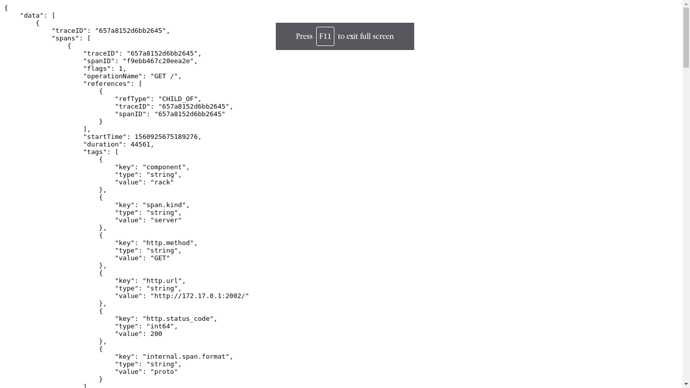

## Folder description
1) nginx-open folder contains the code for a nginx server with opentracing enabled and using jaeger as the client.
2) jaeger-sinatara-C folder contains 3 ruby apps configured with jaeger opentracing.

## Running the setup

### Step 1
Start jaeger by running ```docker run -d -e COLLECTOR_ZIPKIN_HTTP_PORT=9411 -p5775:5775/udp -p6831:6831/udp -p6832:6832/udp \
  -p5778:5778 -p16686:16686 -p14268:14268 -p9411:9411 jaegertracing/all-in-one:latest```
  
#### Note 
The 3 ruby apps have been made dependent on each other for the sake of demonstration. In this case hello2 is calling hello which in turn is calling hello3.

### Step 2
Run all the 3 ruby apps by building and running each of the 3 containers in `jaeger-sinatara-C` folder. Make sure to put the correct host of the running jaeger client in the code of the 3 apps in:
```OpenTracing.global_tracer = Jaeger::Client.build(host: '<jaeger-client-host>', port: 6831, service_name: 'hello')```

### Step 3
Now build and run the nginx container in the nginx-open folder. It contains a `jaeger-config` file and make sure to put the host of the running jaeger client in here as well in :
```"localAgentHostPort": "<jaeger-client-host>:6831"```

### Step 4
Now hit the url `localhost:<nginx-server-port>` on your browser. You should see the output as :
```container3 container1 container2```

### Step 5 
Now open your jaeger UI running on `localhost:16686`. Here you will see all your services and their generated traces.

## Some screenshots of the jaeger UI





`
## Note
Till now jaeger is not compatible with elastic search version 7.x . So make sure to use es version 5 or 6.
