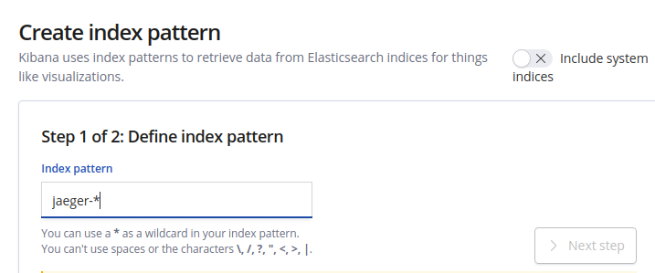
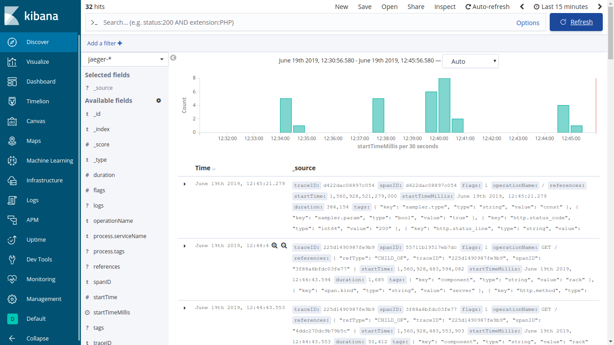
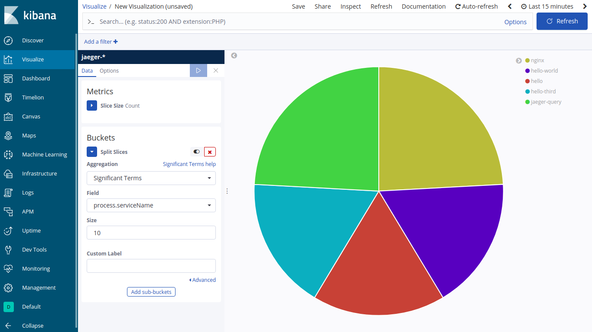

# Docker Monitoring with the ELK Stack for jaeger data
This is the implementation of the jaeger client which is configured to send its generated data to elastic search which can then be visulaized on kibana.

## Running the setup 

Simply run `docker-compose up --build` 
This will get your full elk stack and jaeger client running. Now run whaterver apps or nginx servers that are configured for jaeger opentracing and you will be able to see the data on kibana under the discover section.

## Some screenshots of the jaeger data sent on es

---

---

---
