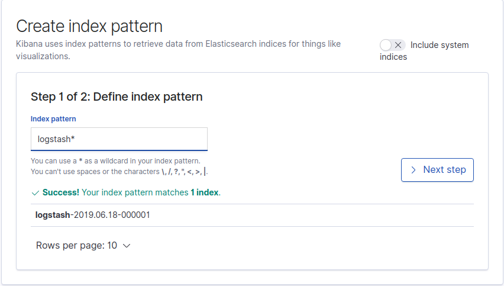
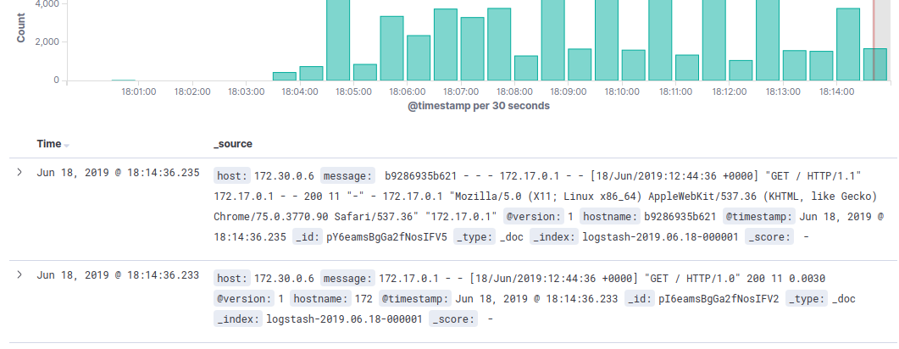
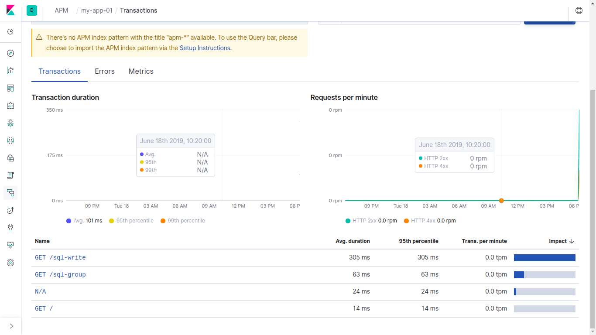
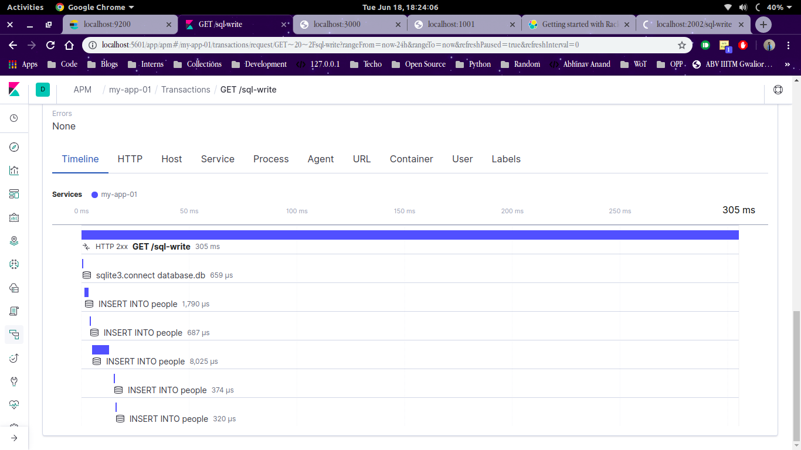
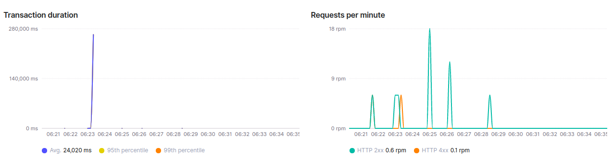
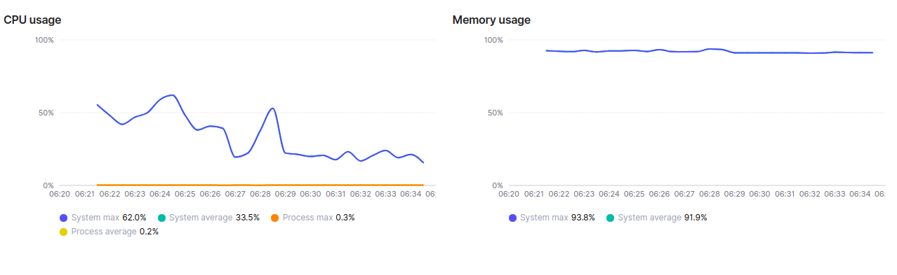
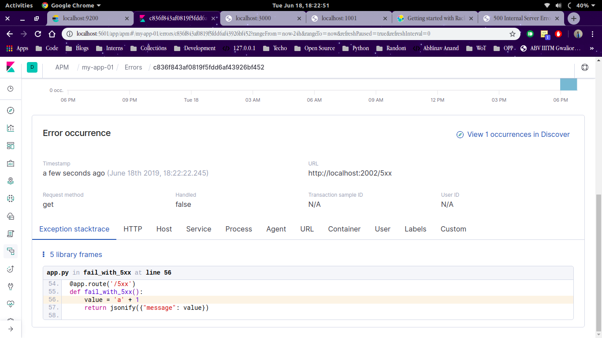

* Running the setup - `docker-compose up --build`

## NOTE
- This setup will start your complete elk stack including elastic search , kibana, logstash and logspout.
Now whatever containers you will run on your host machine , logspout will capture their logs and send them to logstash.
- If you run a container having nginx(or any kind of container) send the nginx logs to stdout as logspout captures the logs from there only.
- To ignore the logs of certain containers you can put `LOGSPOUT=ignore` (as shown in `docker-compose.yml`) file in the environment variable if the containers to be ignored.

---
 

## Configuring Kibana

##### Assuming your apps are up and running following are the steps to collect logs and do the visualization 
 ---
* Open kibana go to the `Management` tool in the lower left corner.
* There you'll see an `Index management` button in lower left corner, click on it to create a new index.




* Enter `logstash-` in input then click on `Next step` then select `@timestamp` from the drop-down and your index would be created
* Now go to `discover` section of Kibana. There you'll able to see the logs. 




* click on any of logs shown to get more information regarding the log.

***

## Configuring APM
---

* There is a `apm-flask-app` folder in the same directory. It contains a flask service with apm configured.
* Run this container separately as this has not been included in `docker-compose` 


#### Building and running the app
* Once your ELK stack is running fetch the host address of the apm container using `docker inspect <containerID>`
* Put the host in the `app.py` file inside the `apm-flask-app` folder on the line 
```
apm = ElasticAPM(app, server_url='http://apm_host:8200', service_name='<servicename>', logging=False)
```

* Now simply build and run the container and hit the flask-app on your browser
* Move to kibana server and goto the APM section there you'll be able to see the app with your `<servicename>`.








### Note -
- The app has a no of end-points defined to check different parameters. Please go through the `app.py` once.
- For configuring a ruby service on apm check this link 
[https://github.com/elastic/apm-agent-ruby](https://github.com/elastic/apm-agent-ruby)
