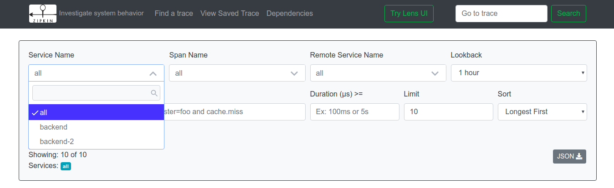
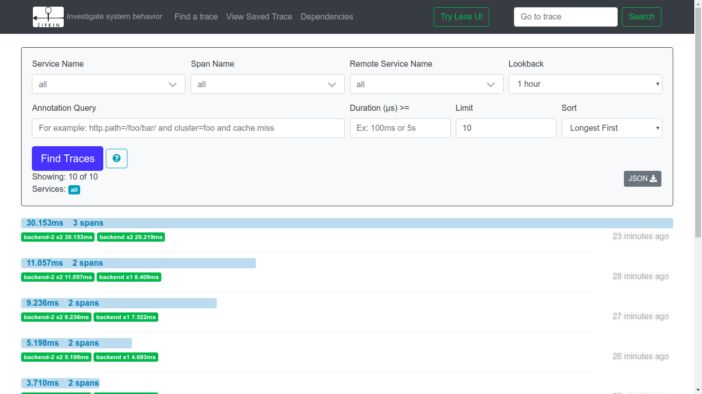
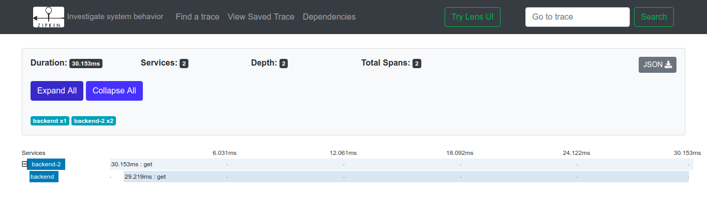
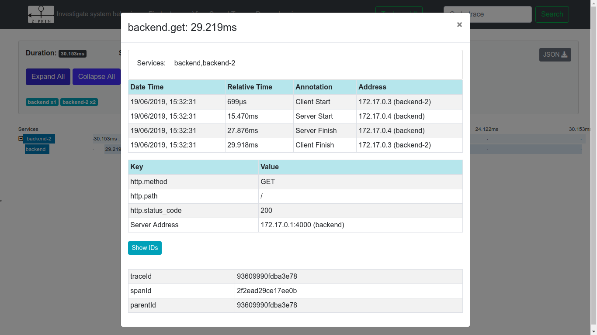
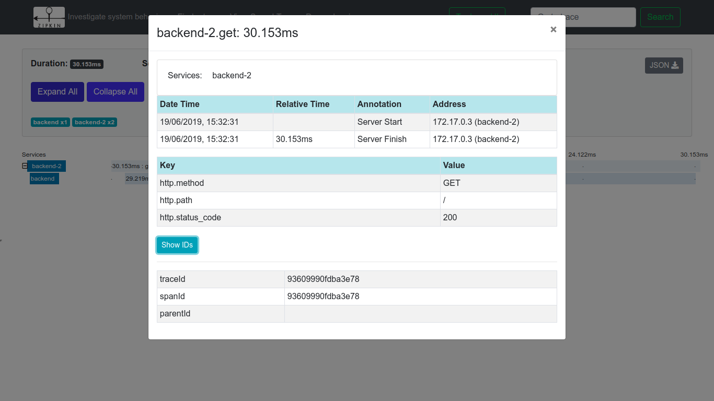
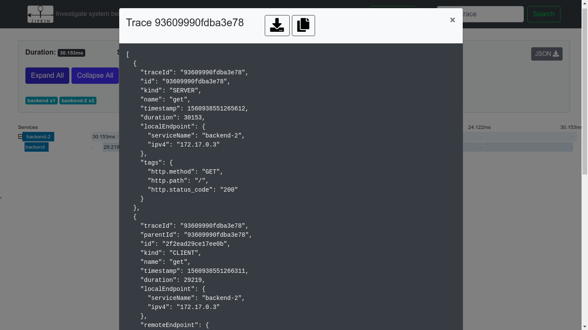
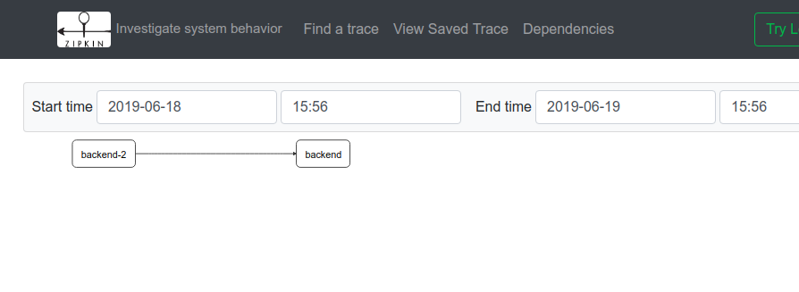

## Folder description
1) nginx-open folder contains the code for a nginx server with opentracing enabled and using zipkin as the client.
2) hello and hello3 folders contains 2 ruby apps configured with zipkin opentracing.


## Running the setup

### Step 1
Start zipkin by running ```sudo docker run -d -p 9411:9411 openzipkin/zipkin```

### Step 2
Run the 2 ruby apps by building and running each of the 2 containers in `hello` and `hello3` folder. Make sure to put the correct host of the running zipkin client in the code of the 2 apps in:
```json_api_host: 'http://<zipkin-client-host>:9411'```

### Step 3
Now build and run the nginx container in the nginx-open folder. It contains a `zipkin-config` file and make sure to put the host of the running zipkin client in here as well in :
```""collector_host": "<zipkin-client-host>"```

### Step 4
Now hit the url `localhost:<nginx-server-port>` on your browser. You should see the output as :
```container3 container1```

### Step 5 
Now open your zipkin UI running on `localhost:9411`. Here you will see all your services and their generated traces.

## Some screenshots of the zipkin UI


---

---

---

---

---

---

---


